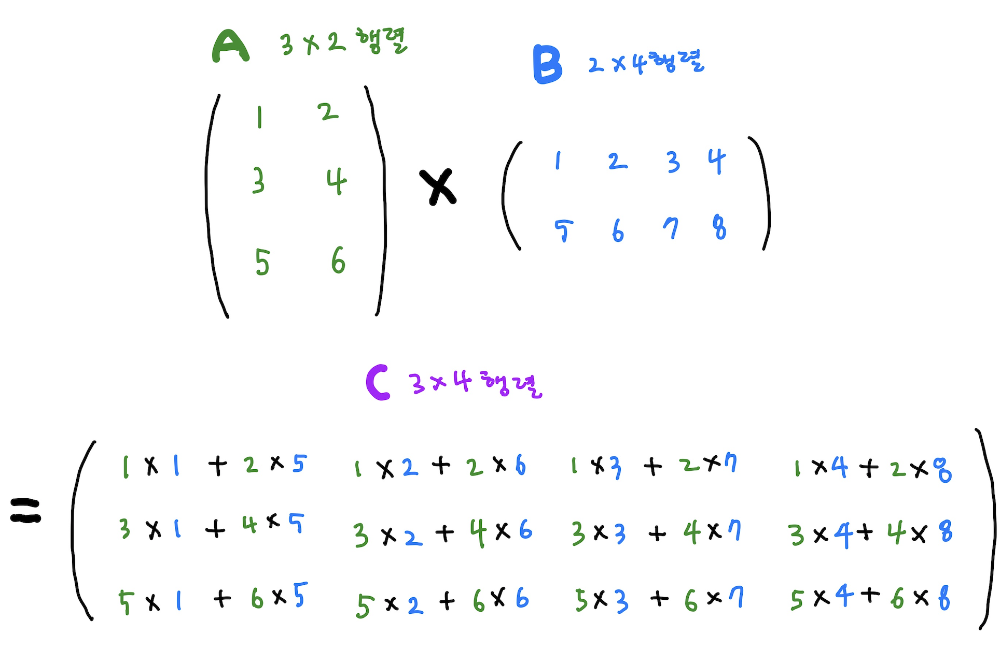

# 문제 링크

[행렬의 곱셈](https://school.programmers.co.kr/learn/courses/30/lessons/12949)

# 1. 내 풀이

해당 문제는 행렬 곱셈 방법을 알고 있으면 쉽게 풀린다고 생각했지만,
제 코드가 for문을 3번 도는 로직이라 제대로 풀지 못한 것 같네요...

```js
function solution(arr1, arr2) {
  let answer = [];
  for (let i = 0; i < arr1.length; i++) {
    let tmp = [];
    for (let j = 0; j < arr2[0].length; j++) {
      let sum = 0;
      for (let k = 0; k < arr2.length; k++) {
        sum += arr1[i][k] * arr2[k][j];
      }
      tmp.push(sum);
    }
    answer.push(tmp);
  }
  return answer;
}
```

## 풀이 방법

행렬 M*N과 행렬 N*K가 주어진다면 결과로 M\*K 행렬이 나옵니다.
그림으로 이해하면 쉬워서 그림 첨부합니다.

여기 그림에서 처럼 코드를 구현하면 되는데,
A 행렬의 각 행에 속해 있는 값과 B 행렬의 각 열에 있는 값을 차례대로 곱해주면 됩니다.

# 2. 느낀 점

for문을 세번 돌아서 성능이 안 좋을 것 같아서 다른 풀이를 봐도 거의 비슷하더라구요.
좀 더 좋은 방법이 있을까요?

# 3. 배운 점
